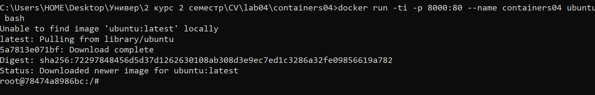

# Лабораторная работа №4. Использование контейнеров как среды выполнения

## Студент
**Gachayev Dmitrii I2302**  
**Выполнено 10.03.2025**  

## Цель работы
Данная лабораторная работа призвана напомнить основные команды ОС Debian/Ubuntu. Также она позволит познакомиться с Docker и его основными командами.
## Задача
Запустить контейнер Ubuntu, установить Web-сервер Apache и вывести в браузере страницу с текстом "Hello, World!".
## Выполнение работы
1. Открываю терминал в папке `containers04` и выполняю команду:

```bash
docker run -ti -p 8000:80 --name containers04 ubuntu bash
```

В консоль выводится следующее:




2. В открывшемся окне выполняю команды:

`apt update` - обновляет список доступных пакетов и их версий.

- APT (Advanced Package Tool) получает актуальную информацию о пакетах из репозиториев

`apt install apache2 -y` -  устанавливает веб-сервер Apache.

- `apt install` – команда для установки пакетов

- `apache2` – имя пакета Apache (веб-сервера)

- `-y` – флаг, который автоматически подтверждает установку

`service apache2 start` - запускает службу Apache.

- `service` – утилита для управления системными сервисами.

- `apache2` – имя службы веб-сервера.

- `start` – команда для запуска сервиса.


## Выводы