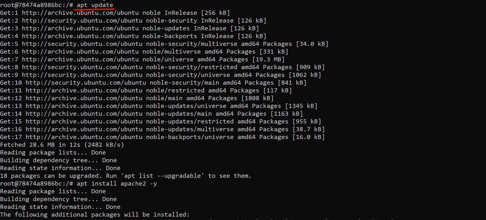
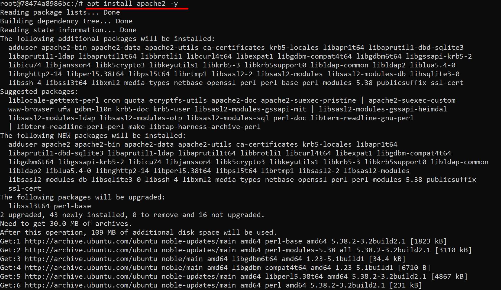
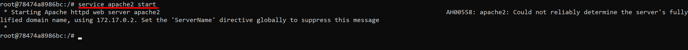
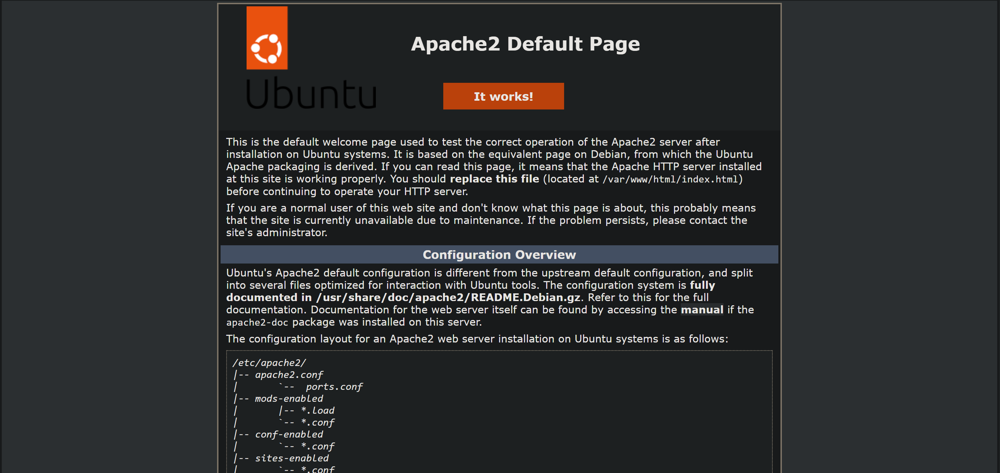
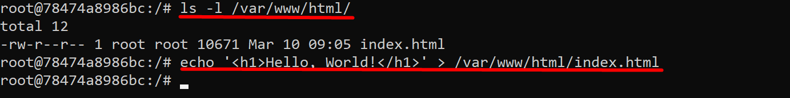

# Лабораторная работа №4. Использование контейнеров как среды выполнения

## Студент
**Gachayev Dmitrii I2302**  
**Выполнено 10.03.2025**  

## Цель работы
Данная лабораторная работа призвана напомнить основные команды ОС Debian/Ubuntu. Также она позволит познакомиться с Docker и его основными командами.
## Задача
Запустить контейнер Ubuntu, установить Web-сервер Apache и вывести в браузере страницу с текстом "Hello, World!".
## Выполнение работы
1. Открываю терминал в папке `containers04` и выполняю команду:

```bash
docker run -ti -p 8000:80 --name containers04 ubuntu bash
```

В консоль выводится следующее:


2. В открывшемся окне выполняю команды:

`apt update` - обновляет список доступных пакетов и их версий.

- `APT (Advanced Package Tool)` получает актуальную информацию о пакетах из репозиториев




`apt install apache2 -y` -  устанавливает веб-сервер Apache.

- `apt install` – команда для установки пакетов
- `apache2` – имя пакета Apache (веб-сервера)
- `-y` – флаг, который автоматически подтверждает установку



`service apache2 start` - запускает службу Apache.

- `service` – утилита для управления системными сервисами.
- `apache2` – имя службы веб-сервера.
- `start` – команда для запуска сервиса.



3. Открываю браузер и перехожу на страницу `http://localhost:8000/`. Вижу следующее: 



Это стандартная страница Apache, оторая отображается при успешной установке и запуске веб-сервера. Это является подтверждением, что сервер работает корректно.

4. Выполняю следующие команды:

```bash
ls -l /var/www/html/
echo '<h1>Hello, World!</h1>' > /var/www/html/index.html
```

`ls -l /var/www/html/`

- `ls` – команда для просмотра содержимого директории.
- `-l` – выводит подробную информацию о файлах (права доступа, владелец и тд).
- `/var/www/html/` – стандартная директория для размещения веб-страниц в Apache.

`echo '<h1>Hello, World!</h1>' > /var/www/html/index.html`

- `echo '<h1>Hello, World!</h1>` – выводит строку `<h1>Hello, World!</h1>`.
- `>` – перенаправляет этот вывод в файл, перезаписывая его (если файл уже существовал, его содержимое будет удалено).
- `/var/www/html/index.html` – файл, в который записывается строка




## Выводы